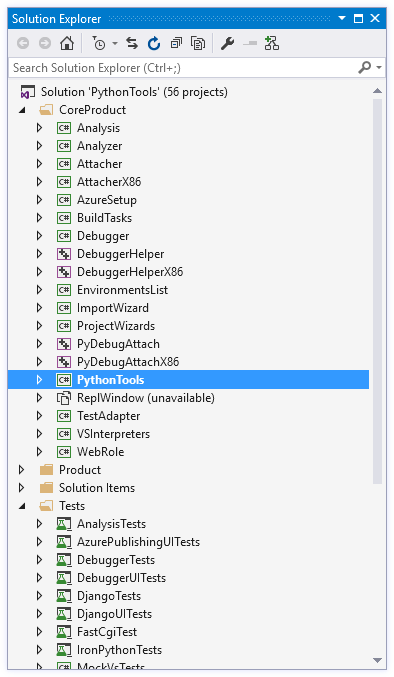
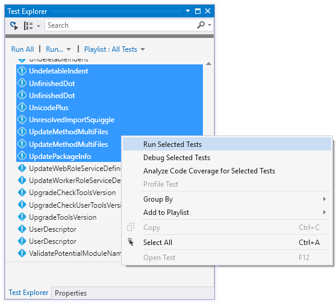

PTVS is an open-source project, and our intent is for others to be able to easily obtain, modify and rebuild the sources. This page provides the instructions necessary 

## Cloning

First, you will require a local copy of our Git repository. It can be cloned from [https://github.com/Microsoft/PTVS.git](https://github.com/Microsoft/PTVS.git). (If you're behind a corporate firewall you may need to enter your proxy settings.)

If you intend to contribute back to PTVS, you should [Create a Fork](https://github.com/Microsoft/PTVS#fork-destination-box) and use the source URL provided there. Pull requests associated with an issue or feature request are the preferred way for making contributions.

## Prerequisites

The following list of software is required in order to build PTVS from source. All of these are required for a complete build, though a complete build is not required to be able to contribute (a later section will outline the projects that may be omitted when building PTVS).

**Software** | **Download**
----- | -----
Visual Studio 2013 **OR** Visual Studio 2015 | Free Community Editions: http://visualstudio.com
Visual Studio SDK | For [VS 2013](https://www.microsoft.com/en-us/download/details.aspx?id=40758) The SDK for VS 2015 is available in the VS 2015 installer
Azure SDK for .NET | [Downloads](http://azure.microsoft.com/en-us/downloads/archive-net-downloads/)
Visual Studio Test Host | [VSTestHost Releases](https://github.com/Microsoft/VisualStudio-TestHost/releases)

Note that you need at least Community Edition of either Microsoft Visual Studio 2013 or 2015. In general, PTVS should be built using the same year version of Visual Studio it is going to be run in, but can be built with Community, Professional or higher.

An existing PTVS installation will interfere with the build process, so if you have already installed PTVS you should uninstall it.

HPC Pack 2008 R2 dependencies | Client Utilities: http://www.microsoft.com/en-us/download/details.aspx?id=17017, SDK: http://www.microsoft.com/en-us/download/details.aspx?id=12218

Finally you'll need to disable strong name verification for the Python Tools binaries. This can be done by merging the `Python\Prerequisites\EnableSkipVerification.reg` file (or `Python\Prerequisites\EnableSkipVerificationX86.reg`, depending on your system architecture). This will install registry keys which disable strong name verification for the assemblies built by PTVS.  If you also want to use the installer you may need to stop and restart the Windows Installer service (from an elevated command prompt, type `net stop msiserver` and then `net start msiserver`).

### Optional Projects

Visual Studio 2010 Professional requires the Standalone Profiler to build the **Profiling, VsPyProf, VsPyProfX86** and **ProfilingUITests** projects. Alternatively, these can be unloaded from the solution if you do not want to install or build the profiler.

The [HPC Pack Client Utilities](http://www.microsoft.com/en-us/download/details.aspx?id=17017) and [SDK](http://www.microsoft.com/en-us/download/details.aspx?id=12218) are required to build the **Hpc** and **MpiShim** projects. You can unload these from the solution if you do not have the HPC tools. These projects are no longer built or distributed with PTVS releases.

The [Azure SDK for .NET](http://azure.microsoft.com/en-us/downloads/archive-net-downloads/) is required for building the **Django**, **WebRole**, **AzureSetup**,  **DjangoTests**, **DjangoUITests** and **FastCgiTests** projects. You can unload these if you do not want to install the Azure SDK.

The **IronPython**, **IronPython.Interpreter**, **IronPythonResolver** projects, as well as those already mentioned, can be unloaded to reduce build time if you do not require these features (note that they can be built without installing IronPython). Unloading **IronPython** will prevent some tests from compiling.

When you are not working on tests, you can unload all projects in the "Tests" solution folder to reduce the build time, though we do expect contributions to include appropriate unit tests.

Core projects are always required to be built, and you will receive build errors if you unload one by mistake. They are grouped under the "CoreProduct" solution folder. The **PythonTools.sln** solution file includes a solution platform called "Minimal" that may be selected within Visual Studio to only build these projects. This will give the fastest possible build times, while only providing core functionality. All of the prerequisites above that are marked optional can be omitted when only building core projects.

### Building with MSBuild

PTVS can be built from the Visual Studio Command Prompt by typing

```
msbuild PythonTools.sln
```

in your cloned directory. This will not install PTVS into the VS Experimental hive, create an installer or affect your main VS installation. Building should complete with zero warnings or errors.


To build using the Release configuration, which produces optimized code, type:

```
msbuild PythonTools.sln /p:Configuration=Release
```

in the cloned directory. As above, this does not create an .msi file or install PTVS into the VS Experimental hive.


To build and deploy to the Experimental hive from the command line, add the following properties:

```
msbuild PythonTools.sln /p:DeployExtension=true /p:RegisterOutputPackage=true
```

The VS Experimental hive can be started from the Start menu or by typing

```
devenv /rootSuffix Exp
```

at the Visual Studio Command Prompt.


### Building with Visual Studio

**PythonTools.sln** can be opened and built in Visual Studio using the **Build Solution** command. To debug, ensure that **PythonTools** is selected as the startup project and use F5 to run PTVS inside of the VS Experimental hive. If an error appears rather than a new instance of VS, ensure the **Project|Debug** settings are correct.




Building in Visual Studio may produce a number of warnings related to potentially incompatible assemblies and missing references. As long as all projects build successfully, these warnings are benign and can be ignored.

If you already have PTVS installed for all users then you will get an error while compiling. The solution is to uninstall PTVS, or to reinstall it for the current user only. To install for the current user, install from the command line using:

```
msiexec /i PythonToolsInstaller.msi ALLUSERS=""
```

Note that this is an unsupported configuration for PTVS and some features may not behave correctly.

### Running Automated Tests

PTVS contains a large number of automated tests, including a mix of UI-based tests (which will start another VS, take control of your mouse, etc.) and non-UI tests. Some of the UI-based tests may fail intermittently or interfere with each other, while some tests may make incorrect assumptions about your system configuration (such as the availability of certain versions of Python). It is best to select the tests you need from the **Test Explorer** window and supervise them as they run.



### Building the Installer

The simplest way to build the installer is to run the release script `Python\Setup\BuildRelease.ps1` with PowerShell. This script produces an installer for each supported and available version of Visual Studio, with an automatically generated version number, and archives the source code, binaries, symbols, and installers into an output directory.

From PowerShell:

```
Python\Setup\BuildRelease.ps1 D:\PTVS_out -skiptests
```

Or, from a regular command prompt:

```
powershell -ExecutionPolicy Unrestricted Python\Setup\BuildRelease.ps1 D:\PTVS_Out -skiptests
```


The output directory will contain VS 201x\Debug and VS 201x\Release folders (for each installed VS version) and a Sources folder. The Debug and Release directories will contain the installers, and the top level will contain all the release installers. This is the same script which we use to builds releases of PTVS, so you'll get an installer which works just like the released versions. However, unless you sign the binaries with your own code signing certificate, the installer will only work if the **EnableSkipVerification.reg** (or **EnableSkipVerificationX86.reg**) file has been merged into the registry on the destination computer.

To build PTVS for Visual Studio 2010 and/or Visual Studio 2012, you should provide `-vstarget 10.0, 11.0`, as these versions are now disabled by default. You are also likely to encounter build errors as we are no longer testing changes against these versions.

The script provides many more options. From PowerShell, type `Get-Help .\BuildRelease.ps1` for more information and `Get-Help .\BuildRelease.ps1 -examples` for some examples.