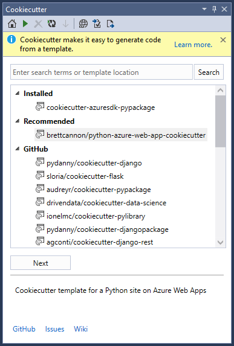
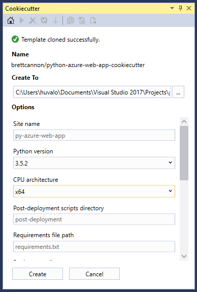

# Cookiecutter

## About Cookiecutter

Cookiecutter is a utility that creates projects/files from templates.

The Cookiecutter extension for Visual Studio provides a graphical user interface to discover templates, input template options and create projects/files.

To learn more about Cookiecutter, using templates, or creating your own templates, see the [official Cookiecutter documentation](https://cookiecutter.readthedocs.io/en/latest/).



## Prerequisites

### Visual Studio 2017

The Cookiecutter extension is included with Visual Studio 2017.

Select either **Python development** or **Data science and analytical applications** workloads, or add it as an individual component by selecting **Cookiecutter template support**.

### Python interpreter

Cookiecutter support requires an installation of Python 3.3 or later (32-bit or 64-bit).

Both **Python development** or **Data science and analytical applications** include a compatible Python interpreter by default. You can also add them as individual components: **Python 3 (3.5.2)**, **Anaconda3 (4.2.0)**.

The latest CPython distributions are also available from [python.org](https://www.python.org/downloads/windows/). 

Cookiecutter window will display a warning if it doesn't find a compatible Python interpreter. If you install Python while VS is running, click the Home button on the Cookiecutter toolbar to detect the newly installed interpreter.

## Using Cookiecutter extension

To open the Cookiecutter window, go to View -> Cookiecutter Explorer.

### Discover templates

The home page displays a list of templates to choose from.

- **Installed**: These are templates that have been installed to your local machine. When an online template is used, its repository is automatically cloned to a subfolder of `~/.cookiecutters`. You can delete a selected installed template by pressing **Del**.

- **Recommended**: These are templates loaded from the recommended feed. The default feed is curated by Microsoft. See the Cookiecutter Options section below for more information on customizing the feed.

- **GitHub**: These are GitHub search results for the cookiecutter keyword. Results from GitHub come back paginated, if more results are available, a 'Load More' will appear at the end of the list. Click on it retrieve the next page of results.

- **Custom**: When a custom location is entered in the search box, it will appear in this section. You can either type in a full path to the GitHub repository, or the full path to a folder on your local disk.

Once you've selected the template you want to use, click on **Next**. This will clone the template's repository to your local machine, if necessary, then it will load the template.

### Cloning

Cookiecutter templates that are located in a git repository online must be cloned to your local machine before they can be loaded by Cookiecutter.

If you select a template from the **Recommended** or **GitHub** sections, or if you enter a custom URL into the search box and select that template, it will be cloned/installed on your local machine. If that template was installed in a previous session of Visual Studio, it will automatically delete the installed template, and clone the latest version.

If you select a template from the **Installed** section, or if you enter a custom folder path into the search box and select that template, it will load the template from your local machine (no cloning).

**Limitation**: Cookiecutter templates are cloned/installed under a single folder `~/.cookiecutters`. Each subfolder is named after the git repository name, which does **not** include the GitHub user name. This can cause conflicts if you attempt to clone/install 2 different templates with the same name (for example, you'll find a few templates named `cookiecutter-flask`). When that happens, the tool will prevent you from overwriting your existing template with a different template of the same name. To confirm, delete the installed template with `Del` and try installing again.

### Output Location

After the template is loaded successfully, the view will change to a form where the first input field is **Create To**. This allows you to specify where your want Cookiecutter to generate files.

**Important**: The files that are created by Cookiecutter will be copied directly to the folder that you've specified. The subfolder that is created by the cookiecutter command-line tool will not appear.

If you specify a folder that isn't empty, a warning message will pop up when you click **Create**.

If you are familiar with the template's output and are okay with it potentially overwriting files in your output folder, you can dismiss the warning. If not, you should cancel and select an empty folder, and manually copy the created files to your non-empty output folder.

### Template Options

Each Cookiecutter template defines its own set of options, and specifies a default value for each one. The default value is displayed in both tooltip and text box watermark.



Sometimes the default value may be a code snippet. This happens when an option's default value is calculated dynamically (often based on another option value). If you are okay with using the dynamic value, you can leave the text box empty.

It is possible to define user default values for specific options by using a user configuration file. When the Cookiecutter extension detects a user configuration file, it will overwrite the template's default values with the user config's default values. See the [official Cookiecutter documentation on User Config](https://cookiecutter.readthedocs.io/en/latest/advanced/user_config.html) to learn how to create your personal configuration file.

### Create

Click **Create** to launch Cookiecutter with the specified output folder and options.  Click **Cancel** to go back to the home page to select a different template.

After the files are created successfully, you will have the option to open the files in **Solution Explorer**.


## Cookiecutter Options

To see the options, go to Tools -> Options -> Cookiecutter.


### Recommended Feed URL

This is the location of the recommended templates feed. It can be a URL or a path to a local file. Leave the URL empty to use the default Microsoft curated feed.

The contents of the feed is a simple list of template locations, separated by newlines.

To request changes to the official feed, make a pull request against [the source on GitHub](https://github.com/Microsoft/PTVS/blob/master/Python/Product/Cookiecutter/CookiecutterFeed.txt)

### Show Help

This controls the visibility of the help information bar at the top of the Cookiecutter tool window.

## Optimizing Cookiecutter Templates for Visual Studio

For the basics of authoring a Cookiecutter template, see the [official Cookiecutter documentation](https://cookiecutter.readthedocs.io/en/latest/).

The default rendering of a template variables depends on the type of data (string or list).

- String: Label for variable name, text box for entering value, and a watermark showing the default value. Tooltip on the text box shows the default value.
- List: Label for variable name, combo box for selecting a value. Tooltip on the combo box shows the default value.

It is possible to improve on this by specifying additional metadata in your `cookiecutter.json` file. This metadata is specific for Visual Studio, and if present, the Cookiecutter CLI will simply ignore it.

Note: The Cookiecutter extension supports templates created for Cookiecutter v1.4.

Here is an example `cookiecutter.json` where additional Visual Studio metadata is included.

```
{
    "site_name": "web-app",
    "python_version": ["3.5.2", "2.7.12"],
    "use_azure": "y",

    "_visual_studio": {
        "site_name": {
            "label": "Site name",
            "description": "E.g. <site-name>.azurewebsites.net (can only contain alphanumeric characters and `-`)"
        },
        "python_version": {
            "label": "Python version",
            "description": "The version of Python to run the site on"
        },
        "use_azure" : {
            "label": "Use Azure",
            "description": "Include Azure deployment files",
            "selector": "yesno",
            "url": "https://azure.microsoft.com"
        }
    }
}
```

### Label

Optional. When a `label` is specified, it will appear above the editor for the variable, instead of the name of the variable.

### Description

Optional. When a `description` is specified, the tooltip that appears on the edit control will show that description, instead of the default value for that variable.

### URL

Optional. When a `url` is specified, the label becomes a hyperlink, with a tooltip that shows the URL. Clicking on the hyperlink will open the user's default browser to that URL.

### Selector

Optional. A `selector` allows customization of the editor for a variable. The following selectors are currently supported:

- `string`: Standard text box, default for strings.
- `list`: Standard combo box, default for lists.
- `yesno`: Combo box to choose between `y` and `n`, for strings.
- `odbcConnection`: Text box with a "..." button that brings up a database connection dialog.


## Running Visual Studio specific tasks after creation (NEW in upcoming RC update)

Cookiecutter has a feature (Post-Generate Hooks) that allows for running arbitrary Python code after the files are generated. It is pretty flexible, but it doesn't allow easy access to Visual Studio. For example, you may want to open a file in the Visual Studio editor, or in its web browser, or trigger the Visual Studio UI that prompts the user to create a virtual environment and install package requirements.

To allow these scenarios, Visual Studio will look for extended metadata that describes the commands to execute. These will run after the user opens the generated files in solution explorer (or after the files are added to an existing project).

You define the commands by adding a section to cookiecutter.json. Here is an example:

```
  "_visual_studio_post_cmds": [
    {
      "name": "File.OpenFile",
      "args": "{{cookiecutter._output_folder_path}}\\readme.txt"
    },
    {
      "name": "Cookiecutter.ExternalWebBrowser",
      "args": "https://docs.microsoft.com"
    },
    {
      "name": "Python.InstallProjectRequirements",
      "args": "{{cookiecutter._output_folder_path}}\\dev-requirements.txt"
    }
  ]
```

The commands are specified by name, and should use the non-localized (English) name in order to work on localized installs of Visual Studio. You can test and discover command names in the Visual Studio Command Window.

If you want to pass a single argument, you can specify it as a string like in the previous example.

If you don't need to pass an argument, you can leave it an empty string or omit it from the JSON:

```
  "_visual_studio_post_cmds": [
    {
      "name": "View.WebBrowser"
    }
  ]
```

For more than one argument, you'll need to use an array. For switches, you'll need split the switch and its value in 2 separate arguments in order to ensure proper quoting. For example:

  "_visual_studio_post_cmds": [
    {
      "name": "File.OpenFile",
      "args": [
        "{{cookiecutter._output_folder_path}}\\read me.txt",
        "/e:",
        "Source Code (text) Editor"
      ]
    }
  ]

Arguments can refer to other Cookiecutter variables. In the examples above, the internal `_output_folder_path` variable is used to form an absolute path to generated files.

Note that the `Python.InstallProjectRequirements` command will only work when adding files to an existing project. That's because it is processed by the Python project in Solution Explorer, and there's no project to receive the message while in Solution Explorer - Folder View. This is a limitation we hope to address in a future release (better Folder View support in general).

## Troubleshooting

### Error loading template

Some templates may be using invalid data types, such as boolean, in their `cookiecutter.json`. This should be reported to the template author. Click on the **Issues** link in the template information pane.

### Hook script failed

Some templates may use post-generation scripts that are not compatible with the Cookiecutter UI. For example, scripts that query the user for input will fail due to not having a terminal console.

### Hook script not supported on Windows

If the post script is `.sh`, then it may not be associated with an application on your Windows machine. You may see a Windows dialog pop up asking you to find a compatible application in the Windows store.

### Templates with known issues

This isn't an exhaustive list, but we'll update it as we find more. I've checked the top 25 GitHub results so far.

Clone failures

- **wildfish/cookiecutter-django-crud** (invalid character `|` in subfolder name)
- **cookiecutter-pyvanguard** (invalid character `|` in subfolder name)

Load failures

- **chrisdev/wagtail-cookiecutter-foundation** (uses a boolean type in cookiecutter.json)
- **quintoandar/cookiecutter-android** (no template folder)

Run failures

- **iknite/cookiecutter-ansible-role** (post hook script requires console input)
- **benregn/cookiecutter-django-ansible** (jinja error)

Uses bash (not fatal)

- **openstack-dev/cookiecutter**
