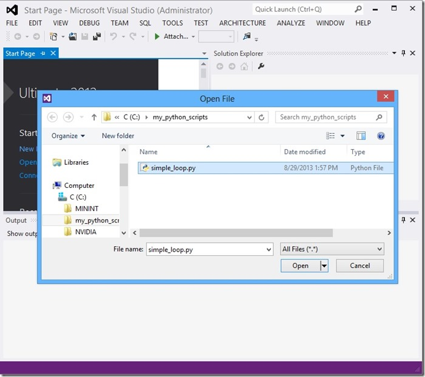
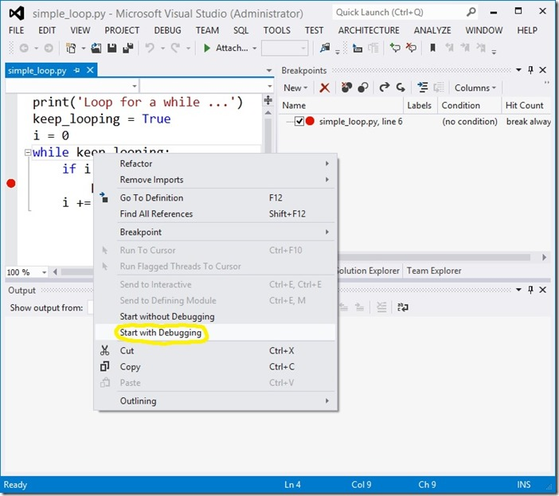
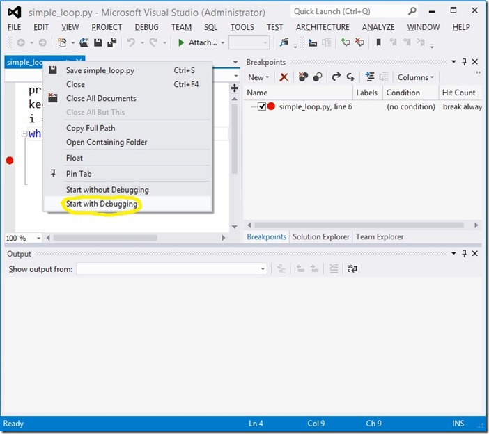
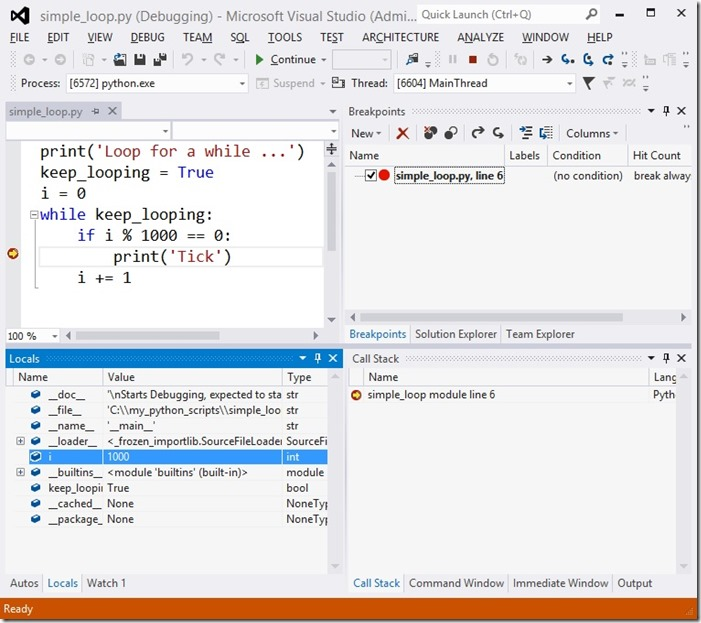
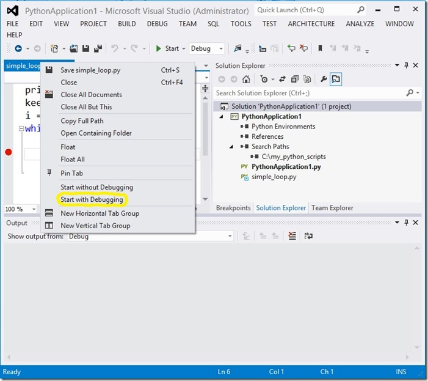
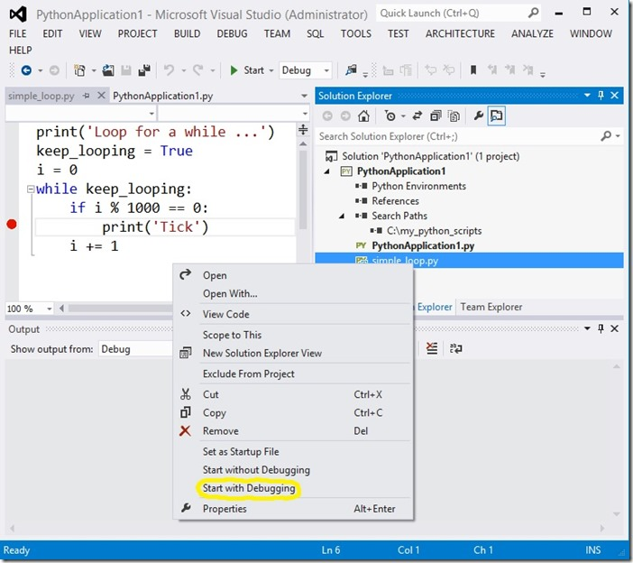
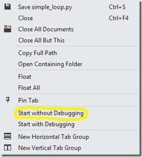

**New in PTVS 2.0**
** For a quick overview, please watch this [video](http://www.youtube.com/watch?v=QADxwr0wjU4).

PTVS 2.0 includes support for debugging any Python script file, without a project, by simply opening it in VS, right clicking on it and choosing ‘Start with debugging’.

In general, you take the following steps to debug a miscellaneous Python script file:
* Start VS (with PTVS 2.0 installed)
* Choose ‘File/Open/File…’
* Select and open the Python script file of your choice
* Set desired breakpoints within the Python script file
* Right click within the document window and choose ‘Start with Debugging'

Note that you may also invoke ‘Start with Debugging’ from an opened Python script file’s tab:

The resulting debugging experience is the same as that for debugging a Python project’s startup file using F5. For example you can set breakpoints, break all, inspect state with the call stack, locals and watch windows, etc.

When debugging a Python script without a containing project open, the VS default interpreter version from Python Tools Options is used.

It is also possible to debug a Python script in the context of a PTVS project opened in VS. To do this, simply open the related project before following the steps above.

The only real difference when debugging a script file which is within a currently open PTVS project is that, if the project has a non-default Python environment activated, it will be used. Otherwise, the VS default interpreter version will be used.

There is one more way to Debug a Python script when a PTVS project is open. In the solution explorer you can right click on a PTVS project’s Python script file and chose ‘Start with Debugging’:

It is worth noting that everywhere that you may invoke ‘Start with Debugging’,&nbsp; you may alternately invoke ‘Start without Debugging’:

This has the effect of running the Python script using the VS default interpreter version, or an opened project’s active Python environment, only without debugging:).
