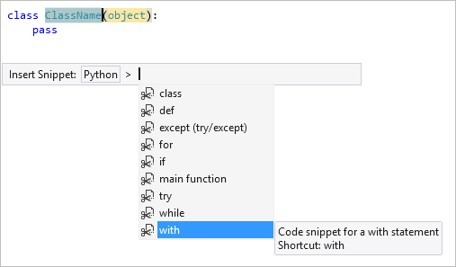
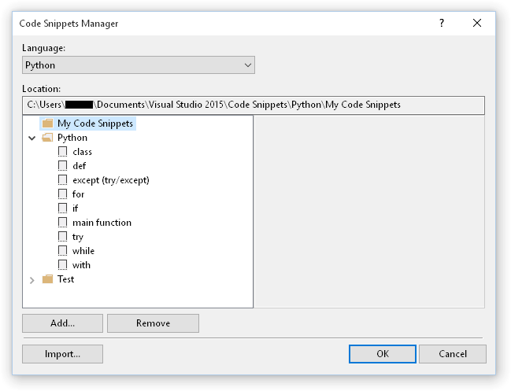
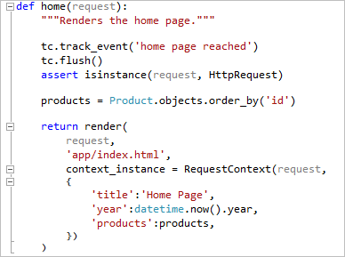

The Editor
==========

When developing, most of your time is spent in the text editor.
Python Tools provides a rich editor with functionality to help you be more productive, such as syntax highlighting, identifier and member completion, signature help, method overrides, and search and navigation.
A background analysis engine uses type inference and whole-program analysis to determine the possible types of each variable, ensuring that the information provided is accurate and up to date.

For a four minute video introduction to editing Python code, see this video.

This section describes the editor features in detail.

IntelliSense
------------

IntelliSense exposes results of analyzing your programs in three different forms: completions, signature help, and quick info.

### Before You Begin

To improve performance, a lot of Python's IntelliSense features depend on a *completion database*.
This database is automatically generated in the background for each version of Python you have, and contains all the information about its standard library and any other installed packages.
You can see the current state of the database in the Python Enviroments list (Ctrl+K, &#96; - Control + K, backtick):

Databases may need refreshing if you add, remove or update packages.
Select "IntelliSense" from the dropdown to see the current status of each package, and click the "Refresh DB" button at any time to start refreshing.
You can close Visual Studio or continue to work while refreshing, but be aware that this is a CPU and memory intensive process that may take over an hour.
In general, a full refresh will only occur once; subsequent refreshes will be much faster.

### Completions

Completions are shown as a list of words that may be entered at your current location.
The lists are based on the context and are filtered to avoid showing options that are incorrect or distracting.
Completions can be shown at any time by pressing Ctrl+J or Ctrl+Space, or may be triggered automatically by certain commands (such as `import`), operators (such as a period/full stop), or by typing at any place where completions are likely to be helpful.

(To prevent completions from appearing automatically, disable Tools -> Options -> Text Editor -> Python -> Advanced -> Auto list members, or "Automatically show completions for all identifiers" to only prevent completions when typing letters.
You can still manually show completions by pressing Ctrl+J or Ctrl+Space.)

With a list open, you can search for the completion you want using the arrow keys, the mouse, or by continuing to type.
As you type more letters, the list is further filtered to show likely completions.
This filtering is smart and will let you use shortcuts such as:

* Typing letters that are not at the start of the name, such as 'parse' to find 'argparse'
* Typing only letters that are at the start of words, such as 'abc' to find 'AbstractBaseClass' or 'air' to find 'as_integer_ratio'
* Skipping letters, such as 'b64' to find 'base64'

(To stop filtering the list, disable Tools -> Options -> Text Editor -> Python -> Advanced -> Filter list based on search string.)

Member completions are shown automatically when you type a period after a variable or value, and will display the methods and attributes of the potential types.
If a variable could be more than one type, the list will include all possibilities from all types, with extra information to indicate which types support each completion.
Where a completion is supported by all possible types, it is shown without annotation.

(To only show completions that are supported by all possible types, enable Tools -> Options -> Text Editor -> Python -> Advanced -> Member completion displays intersection of members.) 

By default, members beginning and ending with a double underscore are not shown.
In general, these members should not be accessed directly, but if you need one, typing the leading double underscore will add these completions into the list.

(To always show double-underscore members, disable Tools -> Options -> Text Editor -> Python -> General -> Hide advanced members.) 

The `import` and `from...import` statements display a list of modules that can be imported and, in the case of `from...import`, the members that can be imported from the specified module.

The `raise` and `except` statements will display lists of classes likely to be error types.
These may not include all user defined exceptions, but will help you find suitable built-in exceptions quickly.

The `@` symbol is used to start a decorator.
After typing one of these, a list containing potential decorators will be shown.
Many of these items will not be usable as decorators and you will need to check library documentation to determine which to use.

### Signature Help

Signature help is displayed when writing a function call, and includes any documentation and parameter information that is available.
The amount of information displayed typically depends on how much is written in the documentation strings, but will include any default values.
Signature help appears automatically after typing the `(` in a function call, and can be displayed at any time by pressing Ctrl+Shift+Space inside a function call.

(To stop automatically showing signature help, disable Tools -> Options -> Text Editor -> Python -> General -> Parameter information.
You can still manually display signature help by pressing Ctrl+Shift+Space.)

### Quick Info

Quick Info is a tooltip that is displayed when you hover the mouse over an identifier.
Depending on the identifier, it may display the potential values or types, any available documentation, return types and definition locations.

### Semantic Colorization

Semantic Colorization uses information from code analysis to change the colors of variable names.
For example, variables that refer to modules or classes may be shown in a different color to functions or other values, and parameter names appear in a different color to local or global variables.

(Note that, by default, functions are not shown in bold.)

To customize the colors used, modify the Python entries in Tools -> Options -> Environment -> Fonts and Colors.

(To disable semantic colorization, disable Tools -> Options -> Text Editor -> Python -> Advanced -> Color names based on types.)

### Code Snippets

Code snippets are short pieces of code that can be inserted into your files by typing a shortcut and pressing Tab, or using the Insert Code Snippet or Surround With commands under Edit -> IntelliSense.
For example, typing `class` followed by the Tab key will generate the rest of the class.
You can type over the name and bases list, moving between the highlighted fields with Tab, then press Enter to begin typing the body.

Code snippets can be customized by [creating a code snippet](https://msdn.microsoft.com/en-us/library/ms165394.aspx) and importing it through the Code Snippets Manager.
Find the manager under Tools -> Code Snippets Manager.
If you write a great code snippet that you'd like to share, feel free to post it in a gist and [let us know](https://github.com/Microsoft/PTVS/issues) - we may be able to include it in the next update of PTVS.

Navigation
----------

There are four ways to utilize the program analysis to help you navigate your code.
These are the navigation bar, Go To Definition, Navigate To and Find All References.

### Navigation Bar

The navigation bar is displayed at the top of each editor window and includes a two-level list of definitions.
The left dropdown contains top level class and function definitions in the current file, while the right dropdown has a list of definitions within the scope shown in the left.
As you move around in the editor, these will update to show your current context, and you can also select an entry from these lists to jump directly to in.

 

(To show or hide the navigation bar, enable or disable Tools -> Options -> Text Editor -> Python -> General -> Navigation Bar.)

### Navigate To

Navigate To can be displayed at any time by selecting the Edit -> Navigate To command or pressing Ctrl+Comma.
A search box is provided in the editor where you can type any name to see a list of possible matches in your project.
The same search is used as for completions, and so partial matches will also be displayed.
Double-clicking any name, or selecting with arrow keys and Enter, will navigate to the definition of that item.

### Go To Definition

Go To Definition is invoked through the context menu of an identifier or a keyboard shortcut, typically F12, and will open the file containing the definition of the currently selected identifier.
This works for most class, function, and variable references in your projects and external libraries, provided source code has been found by the analyzer.
If you are unable to go to a definition, it is likely that it was defined in a compiled file and there is no Python source file.

### Find All References

Find All References is also invoked through the context menu or by pressing its keyboard shortcut, typically Shift+F12.
It will display a list of all references to the selected symbol that were found by the analyzer, including definitions, import, accesses, and assignments.
Double-clicking on any item in this list will navigate to its location.

### The Object Browser

When a project is loaded, Python Tools supports using the Object Browser for viewing classes defined in each module and the functions defined in those classes.
The left hand pane of the Object Browser enables you to view all of the modules defined and drill down into them.
As you do so, the right hand side updates to reflect the current class you are browsing, and the bottom right hand pane will show you any information about the method currently selected on the right hand side.

### Outlining

When code is longer than a few lines, Python Tools gives you the ability to collapse that code. When you work in outlined code, you can expand the sections you want to work on, collapse them when you are done, and then move to other sections. When you do not wish to have outlining displayed, you can use the Stop Outlining command to remove the outline information without disturbing your underlying code. 

You can choose to hide some code from view by collapsing a region of code so that it appears under a plus sign (+). You expand a collapsed region by clicking the plus sign. (Or you can press CTRL + M + M to collapse a region and then CTRL+ M + M to expand it again.) You can also collapse an outlining region by double-clicking any line in the region on the outlining margin, which appears just to the left of the code. You can see the contents of a collapsed region as a tooltip when you hover over the collapsed region. 

Regions in the outlining margin are also highlighted when you hover over the margin with the mouse. The default highlighting color may seem rather faint in some color configurations. You can change it in Tools, Options, Environment, Fonts and Colors, Collapsible Region.

Arbitrary regions can be defined by putting `# region` and `# endregion` comments around a block of code.

