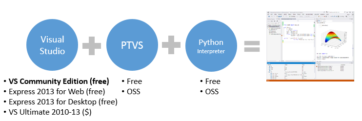
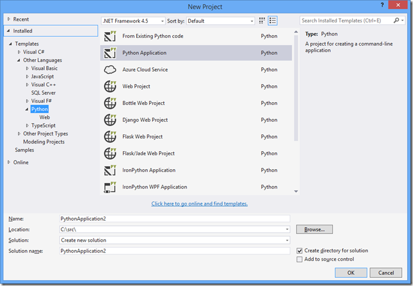

Python Tools for Visual Studio Installation
===========================================

## Quick Start

Here's the general overview of installing the IDE:

1. Install Visual Studio 2015 Community or higher and select Custom installation.

2. Check "Python Tools for Visual Studio" under "Programming Languages"

3. Install a Python interpreter and libraries (these are *not* bundled with PTVS)

## A complete and perpetually FREE Python IDE

The Python Tools for Visual Studio extension is completely free, and there are many free Visual Studio editions that can use it.

* [Visual Studio 2015](http://visualstudio.com)
 * Community Edition
 * Express for Web
 * Express for Desktop
* Visual Studio 2013
 * Community Edition
 * [Express for Web](http://go.microsoft.com/?linkid=9832232)
 * [Express for Desktop](http://go.microsoft.com/?linkid=9832280)

We recommend using Visual Studio 2015 Community Edition, which is the most powerful and has the best extension support. The Express for Web editions are focused on web development and have fewer features, while Express for Desktop includes C++ and features for native development but no web support.

## 1. Install VS & PTVS

**Which one describes you?** | **Installation steps** | **Links**
----- | ----- | -----
I already have Visual Studio **2015** and just want Python support | Modify VS through Programs and Features and select Python Tools for Visual Studio |
I already have Visual Studio **2013** and just want Python support | Install PTVS and you are good to go. | [PTVS 2.2 for VS 2013](https://github.com/Microsoft/PTVS/releases/v2.2)
I only have Visual Studio 2012 or 2010, but I still want PTVS | Install PTVS 2.1 | PTVS 2.1 for [VS 2012](https://pytools.codeplex.com/downloads/get/920478) and [VS 2010](https://pytools.codeplex.com/downloads/get/920479)
I don't have VS installed and want the FREE PTVS/VS version! | Install VS 2015 Community Edition (recommended), Express 2015 for Web or for Desktop   Install PTVS | Visual Studio 2015 [Community Edition](TODO)  [Express for Web](TODO)  [Express for Desktop](TODO)  [PTVS 2.2 for VS 2015](https://github.com/Microsoft/PTVS/releases/v2.2)

## 2. Select and install an interpreter

**Interpreter** | **Description** | **Download Link**
----- | ----- | -----
CPython | This is the native Python interpreter. Best for max language and library compatibility. We recommend 3.5 32-bit for new projects or 2.7 for compatibility with legacy packages. | All versions: http://python.org/download/ [Python 2.7.10 32-bit](https://www.python.org/ftp/python/2.7.10/python-2.7.10.msi) [Python 3.5.0 32-bit](https://www.python.org/ftp/python/3.5.0/python-3.5.0-webinstall.exe)
IronPython | This is the .NET implementation of Python. Best for interfacing with C#. We recommend 2.7.5. | [IronPython 2.7.5](http://ironpython.codeplex.com/downloads/get/970325)
Anaconda | This is a distribution by Continuum Analytics that includes CPython and many useful packages. | http://www.continuum.io/downloads
Canopy | This is a distribution by Enthought that includes CPython 2.7 and many useful packages. | https://www.enthought.com/downloads/

Help me decide [which interpreter is best for me](Selecting-and-Installing-Python-Interpreters).

In general, we recommend installing a distribution rather than a standalone interpreter, as most people encounter issues installing libraries. See [Python Package Installation Options](#python-package-installation-options) below for more ways to get packages.

## 3. Let's make sure everything installed OK

Start Visual Studio: go to File -> New -> Project. Depending on which interpreters(s) you've installed, you should see a list like this. Select "Python Application":

Now start the Interactive Prompt: View -> Other Windows -> Python Interactive. Enter `import sys` and `sys.version`. You should see something similar to this:

## 4. You're All Set!

You have everything you need to start programming in Python in Visual Studio.

## What's Next?

If you are new to Python, check out some of these free resources:

- [http://inventwithpython.com/bookshelf/](http://inventwithpython.com/bookshelf/)
- [https://docs.python.org/3/](https://docs.python.org/3/)
- [http://learnpythonthehardway.org/](http://learnpythonthehardway.org/)

You may wish to watch a couple of overview videos of PTVS on YouTube to get a feel for the IDE, especially if new to Visual Studio:

- [Getting Started](http://aka.ms/ptvstutorial) (6x 3-5 minute introductory videos)
- [Overview of PTVS 2.1 features](http://youtu.be/UrD9aKxvPcY)
- [Overview of PTVS 2.0 features](http://www.youtube.com/watch?v=JNNAOypc6Ek)
- [Live Debug REPL](http://www.youtube.com/watch?v=erNx2NLu-t4)
- [Performance Profiling](http://www.youtube.com/watch?v=VCx7rlPyEzE)
- [Full list of videos on YouTube](http://www.youtube.com/results?search_query=ptvs+python&oq=ptvs+python&gs_l=youtube.3...0.0.0.59047.0.0.0.0.0.0.0.0..0.0...0.0...1ac.) 

You may also wish to browse the wide selection of Python packages and install some that are of interest to you.  You can:

- Install individual packages
- Install a full distro 

Interested in web development? Check out the [Python Developers](http://azure.microsoft.com/en-us/develop/python/) page on [azure.microsoft.com](http://azure.microsoft.com/).

## Python Package Installation Options  

What makes Python awesome is the breadth and depth of freely available packages. For a taste, browse through [PyPI](https://pypi.python.org/pypi), or [SciPy.org](http://scipy.org/Topical_Software)'s Topical Software.  You can install Python packages individually or via a full "distro". Installing individual packages allows you to tailor your environment with a smaller footprint. distros on the other hand may come with hundreds packages that have been pre-built and well tested together. We generally recommend installing a distro unless you are experienced at managing packages and dependencies.

## 1. Installing a full distro [Recommended]

There are several Python distros available. Most have free and paid versions, as well as 32-bit and 64-bit editions.

**Distro** | **Distributor** | **Download Link**
----- | ----- | -----
Anaconda | Continuum Analytics, Inc | http://www.continuum.io/downloads
Canopy | Enthought, Inc | https://www.enthought.com/downloads/
Active Python | ActiveState, Inc | http://www.activestate.com/activepython/downloads

Note: after installing a distro, it may take some time before IntelliSense is available for all packages.

## 2. Installing packages individually

Here are some recommended packages. Generally you want to install packages using `pip` or through the interface in [Visual Studio](Python-Environments) (which uses `pip`), as this will ensure that you get the latest version that will work with your version of Python, as well as any dependencies.

Some packages have complex dependencies and need to be downloaded manually, either from the project's website or from [Christoph Gohlke's package collection](http://www.lfd.uci.edu/~gohlke/pythonlibs/).

**Package** | **Description** | **Download Link**
----- | ----- | -----
numpy | Arrays, linear algebra, FFT's, ... | http://sourceforge.net/projects/numpy/files/NumPy/
SciPy | Stats, signal, image, ODE's, ... | http://sourceforge.net/projects/scipy/files/scipy/
Matplotlib | 2D graphs and plots | http://matplotlib.org/downloads.html
Pandas | Stats. Most of "R"'s cool features. | http://pandas.pydata.org/getpandas.html
IPython | Super REPL, with some integration in PTVS | Install `IPython`
Django | Popular Web Framework | Install `django`
Azure Python SDK | SDK for accessing Windows Azure services and features via Python | Install `azure`

## Questions?

If you are having trouble with installation or need some recommendations:

- Check the issues tracker.  Many installation questions have already been answered and can be searched.
- Start a new issue/discussion.  Someone from the community or the PTVS team will get you going quickly. 

Enjoy!