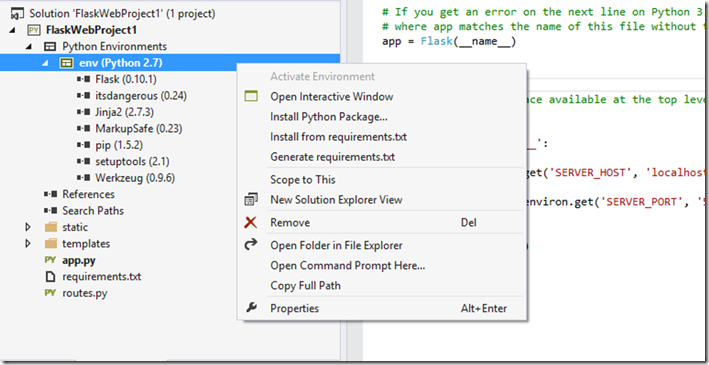

Python Tools for Visual Studio Installation
===========================================

Installing PTVS is relatively easy.    You basically need three things:

1. Visual Studio (paid version or free Pro/Express versions (starting w PTVS 2.1))

2. PTVS extension (this gives VS Python support)

3. A Python interpreter and Python Libraries (these are *not* bundled with PTVS)

# A complete and perpetually FREE Python IDE

As of Nov 2014, VS Pro (Community Edition) is Free.  Starting with PTVS 2.1 and VS 2013, you can also install PTVS into Express for Web and Express for Desktop editions!  The result is a powerful Python IDE that doesn’t cost anything.  The Express for Web edition is focused on Web development, while the Express for Desktop includes C++, etc.   We recommend using the the Community Edition which is the most powerful one.

## 1. Install VS & PTVS

<table border="1" width="703" cellspacing="0" cellpadding="0">
<tbody>
<tr>
<td valign="top" width="201"><strong>Which one describes you?</strong></td>
<td valign="top" width="203"><strong>Installation steps</strong></td>
<td valign="top" width="297"><strong>Links</strong></td>
</tr>
<tr>
<td valign="top" width="201">
<h4>I already have Visual Studio and just want to install PTVS!</h4>
</td>
<td valign="top" width="203">
<ul>
<li>Install the PTVS extension &amp; you are good to go. </li></ul>
</td>
<td valign="top" width="297">

2013: <a title="PTVS 2.1 VS 2013.msi" href="https://pytools.codeplex.com/downloads/get/920477">
PTVS 2.1 VS 2013.msi</a> (Recommended)  
2012: <a title="PTVS 2.1 VS 2012.msi" href="https://pytools.codeplex.com/downloads/get/920478">
PTVS 2.1 VS 2012.msi</a>  
2010: <a title="PTVS 2.1 VS 2010.msi" href="https://pytools.codeplex.com/downloads/get/920479">
PTVS 2.1 VS 2010.msi</a>

</td>
</tr>
<tr>
<td valign="top" width="201">
<h4>I don&rsquo;t have VS installed and want the Free PTVS&#43;VS Version!</h4>
</td>
<td valign="top" width="203">
<ul>
<li>Install the &quot;Community Edition&quot; (recommended) </li><li>Install the &ldquo;Express 2013 for Web&rdquo; or </li><li>&ldquo;Express 2013 for Desktop&rdquo; package with Update 3 or later </li><li>Install PTVS </li></ul>
</td>
<td valign="top" width="297">

1. Install your preferred edition:

<a href="http://www.visualstudio.com/products/visual-studio-community-vs">VS Community Edition (Pro) 
</a><a href="http://go.microsoft.com/?linkid=9832232&clcid=0x409">VS Express 2013 for Web 
</a><a href="http://go.microsoft.com/?linkid=9832280&clcid=0x409">VS Express 2013 for Desktop</a>

2. Install <a href="https://pytools.codeplex.com/downloads/get/920477">PTVS 2.1</a>

</td>
</tr>
</tbody>
</table>

## 2. Select and install an interpreter

<table border="0" width="705" cellspacing="0" cellpadding="2">
<tbody>
<tr>
<td valign="top" width="201"><strong>Interpreter</strong></td>
<td valign="top" width="205"><strong>Description</strong></td>
<td valign="top" width="297"><strong>Download Link</strong></td>
</tr>
<tr>
<td valign="top" width="201">
<h3>CPython</h3>
</td>
<td valign="top" width="205">This is the native Python interpreter.&nbsp; Best for max language and library compatibility.&nbsp; We recommend 32-bit 3.4.2 for new projects&nbsp;or 2.7.9 for maximum package compatibility.</td>
<td valign="top" width="297">All versions: <a href="http://python.org/download/">
http://python.org/download/</a>  
 
<a href="https://www.python.org/ftp/python/2.7.9/python-2.7.9.msi">Python 2.7.9 32-bit Windows Installer</a> 
<a href="https://www.python.org/ftp/python/3.4.2/python-3.4.2.msi">Python 3.4.2 32-bit Windows Installer</a></td>
</tr>
<tr>
<td valign="top" width="201">
<h3>IronPython</h3>
</td>
<td valign="top" width="205">This is the .NET implementation of Python. Best for interfacing with C#.&nbsp; We recommend 2.7.5.</td>
<td valign="top" width="297">

&nbsp;<a href="http://ironpython.codeplex.com/downloads/get/970325">IronPython 2.7.5</a>

</td>
</tr>
</tbody>
</table>

Help me decide [which interpreter to use.](Selecting-and-Installing-Python-Interpreters)

## 3. Let’s make sure everything installed OK

Start Visual Studio: go to File/New/Project.  Depending on which interpreters(s) you’ve installed, you should see a list like this. Select “Python Application”:

Now start the Interactive Prompt: Tools/Python Tools/Python Interactive.   Enter “import sys” and “sys.version”.  You should see something similar to this:

## 4. You're All Set!

You have everything you need to start programming in Python in Visual Studio.

## What's Next?

If you are new to Python, check out some of these free resources:

- [http://inventwithpython.com/bookshelf/](http://inventwithpython.com/bookshelf/)
- [https://docs.python.org/3/](https://docs.python.org/3/)
- [http://learnpythonthehardway.org/](http://learnpythonthehardway.org/)

You may wish to watch a couple of overview videos of PTVS on YouTube to get a feel for the IDE, especially if new to Visual Studio:

- Overview of PTVS 2.0 features](http://www.youtube.com/watch?v=JNNAOypc6Ek)
- [Overview of PTVS 2.1 features](http://youtu.be/UrD9aKxvPcY)
- [Live Debug REPL](http://www.youtube.com/watch?v=erNx2NLu-t4)
- [Performance Profiling](http://www.youtube.com/watch?v=VCx7rlPyEzE)
- [Full list of videos on YouTube](http://www.youtube.com/results?search_query=ptvs+python&oq=ptvs+python&gs_l=youtube.3...0.0.0.59047.0.0.0.0.0.0.0.0..0.0...0.0...1ac.) 

You may also wish to browse the wide selection of Python packages and install some that are of interest to you.  You can:

- Install individual packages
- Install a full Distro 

Interested in web development? Check out the [Python Developers](http://azure.microsoft.com/en-us/develop/python/) page on [azure.microsoft.com](http://azure.microsoft.com/).

## Python Package Installation Options  

What makes Python awesome is the breath/depth of freely available packages.  For a taste, browse through [PyPI](https://pypi.python.org/pypi), or [SciPy.org](http://scipy.org/Topical_Software)’s Topical Software.  You can install Python packages individually or via a full “Distro”.  Installing individual packages allows you to tailor your environment with a smaller footprint.  Distro’s on the other hand come with 100+ packages that have been pre-built and well tested together.  We recommend installing a Distro.

## 1. Installing a full "Distro" [Recommended]

There are several Python Distros available.   Each one has free and paid versions, as well as 32/64 editions.  You should select one that matches your interpreter’s bit-ness:

<table border="0" cellpadding="2" cellspacing="0" width="748">
<tbody>
<tr>
<td valign="top" width="163"><strong>Distro</strong></td>
<td valign="top" width="230"><strong>Distributor</strong></td>
<td valign="top" width="353"><strong>Download Link</strong></td>
</tr>
<tr>
<td valign="top" width="163">Anaconda</td>
<td valign="top" width="230">Continuum Analytics, Inc</td>
<td valign="top" width="353">

<a href="http://www.continuum.io/downloads" target="_blank">http://www.continuum.io/downloads</a>&nbsp;

</td>
</tr>
<tr>
<td valign="top" width="163">Canopy</td>
<td valign="top" width="230">Enthought, Inc</td>
<td valign="top" width="353"><a title="https://www.enthought.com/downloads/" href="https://www.enthought.com/downloads/">https://www.enthought.com/downloads/</a></td>
</tr>
<tr>
<td valign="top" width="163">Active Python</td>
<td valign="top" width="230">ActiveState, Inc</td>
<td valign="top" width="353"><a href="http://www.activestate.com/activepython/downloads">http://www.activestate.com/activepython/downloads</a></td>
</tr>
</tbody>
</table>

Note: after installing a Distro, it’ll take a few minutes before Intellisense is available for all packages.

## 2. Installing packages individually

Here are some recommended packages.  Generally you want to download the latest version that matches your Python interpreter and its bit-ness.  You can install these from their websites, from PyPI, or directly from Professor Chistoph Gohlke’s Python/Windows page:

<table border="0" cellpadding="2" cellspacing="0" width="748">
<tbody>
<tr>
<td valign="top" width="163"><strong>Collection</strong></td>
<td valign="top" width="230"><strong>Distributor</strong></td>
<td valign="top" width="353"><strong>Download Link</strong></td>
</tr>
<tr>
<td valign="top" width="163">CG’s Win Python Pkgs</td>
<td valign="top" width="230">Christoph Gohlke</td>
<td valign="top" width="353"><a title="Python Extension Packages for Windows - Christoph Gohlke" href="http://www.lfd.uci.edu/~gohlke/pythonlibs/">Python Extension Packages for Windows - Christoph Gohlke</a></td>
</tr>
</tbody>
</table>

Starting with PTVS 2.0, you can install packages directly from within PTVS.  Starting with PTVS 2.1, templates such as Flask will prompt to do this for you automatically.  You can also right click on your Python environment and select “Install Python Package”, or “Install from requirements.txt”:

Python packages can be also be installed from outside VS and they’ll show up in the list of installed packages for that Interpreter.  To install packages using Python’s own “pip” utility, install it from [http://www.lfd.uci.edu/~gohlke/pythonlibs/#pip](http://www.lfd.uci.edu/~gohlke/pythonlibs/#pip).  From there, you can simply enter a command (elevated) to grab packages, eg:
	
    pip install Django==1.6

PTVS will detect the addition and start Analysis immediately.

Last but not least, you can Install from each project’s corresponding website:

<table border="0" cellpadding="2" cellspacing="0" width="748">
<tbody>
<tr>
<td valign="top" width="163"><strong>Package</strong></td>
<td valign="top" width="230"><strong>Description</strong></td>
<td valign="top" width="353"><strong>Download Link</strong></td>
</tr>
<tr>
<td valign="top" width="163">Numpy</td>
<td valign="top" width="230">Arrays, linear algebra, FFT’s, …</td>
<td valign="top" width="353"><a title="http://sourceforge.net/projects/numpy/files/NumPy/" href="http://sourceforge.net/projects/numpy/files/NumPy/">http://sourceforge.net/projects/numpy/files/NumPy/</a></td>
</tr>
<tr>
<td valign="top" width="163">SciPy</td>
<td valign="top" width="230">Stats, signal, image, ODE’s, …</td>
<td valign="top" width="353"><a title="http://sourceforge.net/projects/scipy/files/scipy/" href="http://sourceforge.net/projects/scipy/files/scipy/">http://sourceforge.net/projects/scipy/files/scipy/</a></td>
</tr>
<tr>
<td valign="top" width="163">Matplotlib</td>
<td valign="top" width="230">2D graphs and plots</td>
<td valign="top" width="353"><a title="http://matplotlib.org/downloads.html" href="http://matplotlib.org/downloads.html">http://matplotlib.org/downloads.html</a></td>
</tr>
<tr>
<td valign="top" width="163">IPython</td>
<td valign="top" width="230">Super REPL with PTVS integration (such as inline graphics)</td>
<td valign="top" width="353"><a href="http://www.lfd.uci.edu/~gohlke/pythonlibs/">http://www.lfd.uci.edu/~gohlke/pythonlibs/</a>.

Or use Canopy or Anaconda

</td>
</tr>
<tr>
<td valign="top" width="163">Pandas</td>
<td valign="top" width="230">Stats.&nbsp; Most of “R”’s cool features.</td>
<td valign="top" width="353"><a href="http://pandas.pydata.org/getpandas.html">http://pandas.pydata.org/getpandas.html</a></td>
</tr>
<tr>
<td valign="top" width="163">Django</td>
<td valign="top" width="230">Popular Web Framework – PTVS has been tested with V1.5 and&nbsp;V1.6</td>
<td valign="top" width="353">“pip install django==1.6”</td>
</tr>
<tr>
<td valign="top" width="163">Azure Python SDK</td>
<td valign="top" width="230">SDK for accessing Windows Azure services and features via Python</td>
<td valign="top" width="353">“pip install azure”</td>
</tr>
</tbody>
</table>

## Questions?

If you are having trouble with installation or need some recommendations:

- Check the issues tracker.  Many installation questions have already been answered and can be searched.
- Start a new issue/discussion.  Someone from the community or the PTVS team will get you going quickly. 

Enjoy!