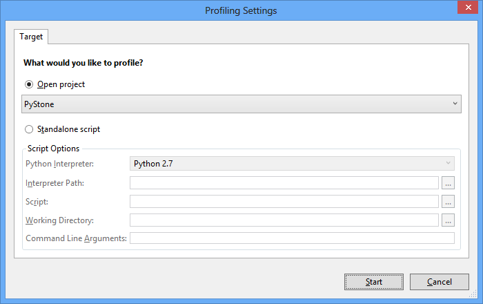
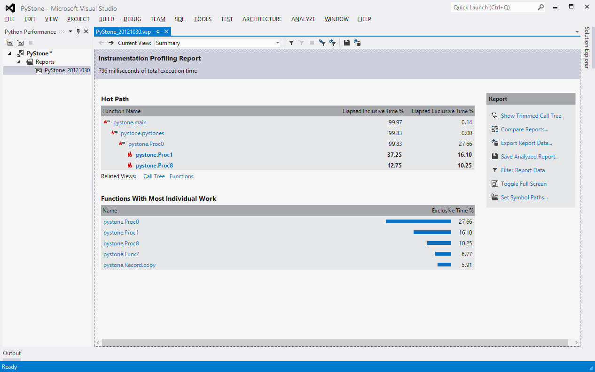

**For a quick overview, please watch a video overview:
[http://www.youtube.com/watch?v=K-KqkFk55k](http://www.youtube.com/watch?v=K-KqkFkp55k)**

## Profiling

Python Tools for Visual Studio also supports profiling your Python program when using CPython-based interpreters. To start profiling you can go to the Analyze menu and select Launch Python Profiling. You can then use the dialog to configure how you’d like to setup profiling: 

When you click OK the profiler will run and then open the resulting performance report. You can then drill into which functions are consuming the most time.

**IronPython**

As previously mentioned profiling support is currently limited to CPython based interpreters due to the instrumentation that is performed.  For profiling against IronPython you have a couple of options:

.NET profiling

To use the normal .NET profiler you can just launch `ipy.exe` directly as your target application with the appropriate arguments to launch your startup script.  You'll also want to provide `-X:Debug` on the command line to force all of your Python code to be debuggable and profilable.  This will result in a performance report which includes time spent both in the IronPython runtime as well as your code.  Your code will be identified using mangled names.

IronPython also has some of its own profiling support built-in but there’s no good visualizer for it.  More information on that’s available here: [http://blogs.msdn.com/b/curth/archive/2009/03/29/an-ironpython-profiler.aspx](http://blogs.msdn.com/b/curth/archive/2009/03/29/an-ironpython-profiler.aspx)
