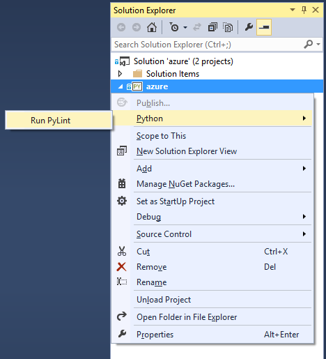

PyLint
======

In Solution Explorer, you'll see a command to run PyLint on your Python project:

If you don't have PyLint installed, you will be prompted to install it into your active Python environment.

Errors reported by PyLint will appear in the Error List window. Double-click on an error and it will take you to the source code.

For more information on controlling settings and suppressing warnings, see the [PyLint documentation](http://docs.pylint.org/).
