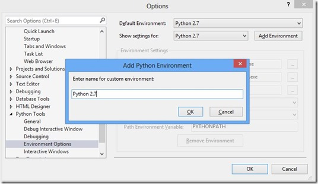
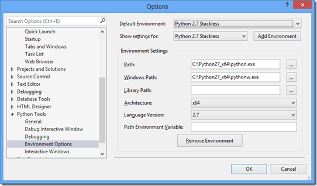
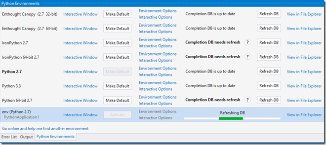

# Which Python interpreter should I install?

PTVS does not come with a Python interpreter – in order to run your code, you need one. So let’s install one!

Fortunately there are several choices and they’re all free:

**CPython** – this is the “native” and most commonly used interpreter.

Attributes:
- Most commonly used, available in 32 and 64 bit versions. 
- Latest language features 
- Maximum Python package compatibility 
- Best debugging experience in PTVS (eg debug on Linux/Mac, Python/C++ debugging) 
- Works with [IPython](http://ipython.org/) 
- Versions: 2.7 (frozen) and 3.x (latest) 

If you’ve already installed VS and PTVS, we recommend the  [latest 32-bit CPython](http://go.microsoft.com/fwlink/?LinkID=299430) (installer) from [www.python.org](http://www.python.org/). Once CPython is installed, it will be auto-detected by PTVS.  If you want more information about the differences between Python 2.x versions and 3.x versions, please visit [http://wiki.python.org/moin/Python2orPython3](http://wiki.python.org/moin/Python2orPython3).

**IronPython** – this is a .NET implementation of Python

Attributes:
- Best .NET (C#/F#/…) interop, available in 32 and 64 bit versions. 
- Versions: 2.7.4 (3.x features underway) 
- Some non-.NET packages can be used via bridges, and others have been ported  
- Standard Python debugging (no mixed .NET/Native debugging) 
- No IPython support 
- Decent mixed IronPython <-> C# debugging 

If you’ve already installed VS and PTVS, we recommend the [2.7.4 version](https://ironpython.codeplex.com/releases/view/90087). This will run an MSI from [http://ironpython.codeplex.com](http://ironpython.codeplex.com/) which will install Python and will be auto-detected by PTVS.

**PyPy** – this is a high performance tracing JIT implementation of Python: [www.pypy.org](http://www.pypy.org/).

**Jython** – Like IronPython, this is an implementation of Python on the JVM: [www.jython.org.](http://www.jython.org/)

Both PyPy and Jython can be used with PTVS (edit, IntelliSense, etc.) but various advanced debugging features may not work.

**Canopy and Anaconda** – both of these distros will also be automatically discovered and added to your list of Python Environments.

## Hey, I already have an interpreter on my machine, but PTVS doesn’t seem to know about it!

Alright, let’s fix that! Normally PTVS can locate an installed Interpreter by checking the registry, but if it’s installed in a non-standard fashion, you can directly tell PTVS about it:

### 1. Go to Tools/Options/Python Tools and choose “Environment Options”.  Click “Add Environment” and add a string that describes it:

### 2. Enter the Path to the location of your interpreter manually or by clicking “…”:

Here we’ve entered “C:\Python27_x64\python.exe” as the **path**. The **Windows Path** is the path to the “Pythonw.exe” version, generally found in the same directory. **Architecture** is automatically detected and filled in for you.  **Language version** can be selected from the drop down menu.

**Path Environment** Variable is the ENV variable that the interpreter will look at to find search paths. PTVS sets it when running within VS, and overwrites any global value. It’s typically set to “PYTHONPATH".

You can view another environment’s settings by clicking **Show settings for**, and delete ones you have added with **Remove Environment**.

### 3. When you have interpreters installed, you can manage them easily via the Interpreters Window. Go to Tools/Python Tools/Interpreters (or Ctrl+K, ` --- Control+K, back-tick):

Here we see that there are several Interpreters installed, including Enthought’s Canopy.   We’ve made CPython 2.7 the current default.   We’ve created a Virtual Environment using CPython 2.7 and its database is currently being refreshed because of an added package.  You can quickly modify each interpreter’s attributes by clicking the **Interpreter Options** link.

Interpreter databases are used to improve IntelliSense speed for the standard library and any libraries installed into site-packages. Analyzing all of the available source files can take anywhere from a minute to an hour or more, depending on what you have installed. However, once complete, you will get detailed IntelliSense and won't have to refresh the database again until you install more libraries.
