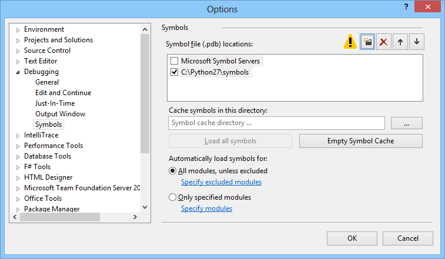

# Symbols for Python mixed-mode debugging

## What exactly do I need, and why?

Python mixed-mode debugger needs to be able to parse numerous internal data structures within Python interpreter being debugged. In order to do so consistently for all supported versions of Python, it needs debug symbols for the Python interpreter. In particular, symbols are required for:

* The main interpreter DLL (python27.dll, python33.dll, {"python27_d.dll or python33_d.dll"}, depending on version of the interpreter, and whether it is a Py_DEBUG build of it).
* CTypes (ctypes.pyd or ctypes_d.pyd), if you want to be able to step into functions imported via ctypes.

A symbol file for a given binary has the same name with .pdb extension. For example, a symbol file for python27.dll will be named python27.pdb.

## Where to download symbols

### Official distribution

If you are using the reference Python interpreter downloaded from the official Python website at http://python.org, then you can download symbols from the same website. To do so, you should open the detailed release page for your Python version, and locate a link described as "Windows x86 MSI program database" (for 32-bit interpreter) or "Windows X86-64 program database" (for 64-bit interpreter). Below are direct download links for all supported versions.

Apart from Python 3.5, all of these downloads are in the form of a .zip file containing the requisite .pdb files. After downloading it, unpack it to any directory, and follow the instructions below on registering them with Visual Studio.

#### Python 2.7
2.7.10: [32-bit](https://www.python.org/ftp/python/2.7.10/python-2.7.10-pdb.zip) | [64-bit](https://www.python.org/ftp/python/2.7.10/python-2.7.10.amd64-pdb.zip)

2.7.9: [32-bit](https://www.python.org/ftp/python/2.7.9/python-2.7.9-pdb.zip) | [64-bit](https://www.python.org/ftp/python/2.7.9/python-2.7.9.amd64-pdb.zip)

2.7.8: [32-bit](https://www.python.org/ftp/python/2.7.8/python-2.7.8-pdb.zip) | [64-bit](https://www.python.org/ftp/python/2.7.8/python-2.7.8.amd64-pdb.zip)

2.7.7: [32-bit](https://www.python.org/ftp/python/2.7.7/python-2.7.7-pdb.zip) | [64-bit](https://www.python.org/ftp/python/2.7.7/python-2.7.7.amd64-pdb.zip)

2.7.6: [32-bit](http://python.org/ftp/python/2.7.6/python-2.7.6-pdb.zip) | [64-bit](http://python.org/ftp/python/2.7.6/python-2.7.6.amd64-pdb.zip)

2.7.5: [32-bit](http://python.org/ftp/python/2.7.5/python-2.7.5-pdb.zip) | [64-bit](http://python.org/ftp/python/2.7.5/python-2.7.5.amd64-pdb.zip)

2.7.4: [32-bit](http://python.org/ftp/python/2.7.4/python-2.7.4-pdb.zip) | [64-bit](http://python.org/ftp/python/2.7.4/python-2.7.4.amd64-pdb.zip)

2.7.3: [32-bit](http://python.org/ftp/python/2.7.3/python-2.7.3-pdb.zip) | [64-bit](http://python.org/ftp/python/2.7.3/python-2.7.3.amd64-pdb.zip)

2.7.2: [32-bit](http://python.org/ftp/python/2.7.2/python-2.7.2-pdb.zip) | [64-bit](http://python.org/ftp/python/2.7.2/python-2.7.2.amd64-pdb.zip)

2.7.1: [32-bit](http://python.org/ftp/python/2.7.1/python-2.7.1-pdb.zip) | [64-bit](http://python.org/ftp/python/2.7.1/python-2.7.1.amd64-pdb.zip)

#### Python 3.3
3.3.5: [32-bit](http://www.python.org/ftp/python/3.3.5/python-3.3.5-pdb.zip) | [64-bit](http://www.python.org/ftp/python/3.3.5/python-3.3.5.amd64-pdb.zip)

3.3.4: [32-bit](http://python.org/ftp/python/3.3.4/python-3.3.4-pdb.zip) | [64-bit](http://python.org/ftp/python/3.3.4/python-3.3.4.amd64-pdb.zip)

3.3.3: [32-bit](http://python.org/ftp/python/3.3.3/python-3.3.3-pdb.zip) | [64-bit](http://python.org/ftp/python/3.3.3/python-3.3.3.amd64-pdb.zip)

3.3.2: [32-bit](http://python.org/ftp/python/3.3.2/python-3.3.2-pdb.zip) | [64-bit](http://python.org/ftp/python/3.3.2/python-3.3.2.amd64-pdb.zip)

3.3.1: [32-bit](http://python.org/ftp/python/3.3.1/python-3.3.1-pdb.zip) | [64-bit](http://python.org/ftp/python/3.3.1/python-3.3.1.amd64-pdb.zip)

3.3.0: [32-bit](http://python.org/ftp/python/3.3.0/python-3.3.0-pdb.zip) | [64-bit](http://python.org/ftp/python/3.3.0/python-3.3.0.amd64-pdb.zip)

#### Python 3.4
3.4.3: [32-bit](https://www.python.org/ftp/python/3.4.3/python-3.4.3-pdb.zip) | [64-bit](https://www.python.org/ftp/python/3.4.3/python-3.4.3.amd64-pdb.zip)

3.4.2: [32-bit](https://www.python.org/ftp/python/3.4.2/python-3.4.2-pdb.zip) | [64-bit](https://www.python.org/ftp/python/3.4.2/python-3.4.2.amd64-pdb.zip)

3.4.1: [32-bit](https://www.python.org/ftp/python/3.4.1/python-3.4.1-pdb.zip) | [64-bit](https://www.python.org/ftp/python/3.4.1/python-3.4.1.amd64-pdb.zip)

3.4.0: [32-bit](https://www.python.org/ftp/python/3.4.0/python-3.4.0-pdb.zip) | [64-bit](https://www.python.org/ftp/python/3.4.0/python-3.4.0.amd64-pdb.zip)

#### Python 3.5
When installing, select "Custom" and check the box to install debugging symbols. You will not need to register the symbol directory later on.

If you've already installed Python 3.5, open Programs and Features, find the Python 3.5 entry, and modify the installation to add the debugging symbols.

### WinPython

WinPython incorporates the stock Python interpreter without changes, so you should use one of the links above for the corresponding version number (e.g. for WinPython 2.7.5.3, get symbols for Python 2.7.5).

### Enthought Canopy

Enthought Canopy provides symbols for its binaries starting from version 1.2. They are automatically installed alongside with the distribution, but you will still need to manually add the directory with them to symbol path as described below. For a typical per-user installation of Canopy, the symbols are located in %UserProfile%\AppData\Local\Enthought\Canopy\User\Scripts for the 64-bit version, and %UserProfile%\AppData\Local\Enthought\Canopy32\User\Scripts for the 32-bit version.

Enthought Canopy 1.1 and earlier, as well as Enthought Python Distribution (EPD), do not provide interpreter symbols, and are therefore not compatible with mixed-mode debugging. You will need to upgrade to Canopy 1.2 to use mixed-mode debugging.

### Other third-party distribution

If you're using a third-party Python distribution such as ActiveState Python, you will need to contact the authors of that distribution and request them to provide you with symbols. 

## Registering symbols with Visual Studio

After you have obtained the .pdb files for your interpreter, you should make Visual Studio aware of them, so that it automatically loads them whenever you start debugging. To do so, open Visual Studio, and navigate to Tools -> Options in the main menu, then to Debugging -> Symbols in the dialog that opens. You should see something like this:

Now you need to add the folder in which .pdb files reside to the location list. To do so, click on the "Add" button (first from the left in the row of buttons above the list), and then enter the folder path in the textbox that appears. Click "OK" to close the dialog.

Next time you will start debugging a Python application with mixed-mode debugger, the symbols will be located and loaded, and it will be possible to debug Python code.

