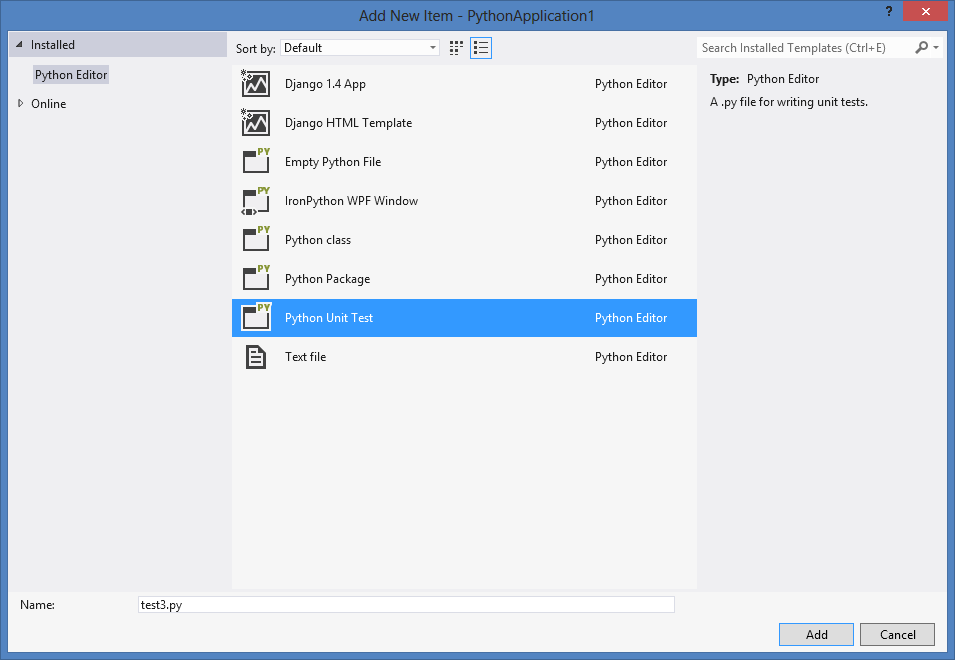

Unit tests are short sections of code that test small pieces of functionality belonging to a larger program. By demonstrating that each piece of a program is correct, it is easier to infer that the entire program is correct.

Python uses unit tests extensively to validate scenarios while designing a program. Python Tools for Visual Studio includes support for discovering, executing and debugging unit tests. This allows you to author your tests and run them without having to switch to a command prompt.

## Discovering Tests

PTVS will discover tests using the standard `unittest` package. To ensure your test can be found and run, follow these rules:

* Import unittest
* Derive a class from unittest.TestCase
* Define a method named "test<name of your test>"
* (Optional) Add a call to unittest.main()
 * This will allow you to run your script directly to execute the tests

To add a module with a test class, select Project -> Add New Item (Ctrl+Shift+A) and choose "Python Unit Test".



This will add a new file containing a basic unit test.

```python
import unittest

class Test_test1(unittest.TestCase):
    def test_A(self):
        self.fail("Not implemented")

if __name__ == '__main__':
    unittest.main()
```

Hit Save All (Ctrl+Shift+S) to save the project file, and your test will be discovered and displayed in the Test Explorer. (If you do not see the Test Explorer window, click the Test menu, then Windows and Test Explorer.)

**Important:** If you do not see your test in the Test Explorer window, check our beta caveats for known issues and workarounds.


As you add more tests to your project, you may prefer to group or filter the tests that are displayed. The "Group By" menu on the toolbar will allow you to collect your tests into different groups, and the search toolbox will filter by matching names. Double-clicking a test will open the source file containing the test implementation.


## Running Tests

Tests can be run by clicking "Run All" in the Test Explorer window, or by selecting one or more tests or groups, right-clicking and selecting "Run Selected Tests". Tests will be run in the background and the display will be updated to show the results.

Tests that pass are shown with a green tick. The amount of time taken to run the test is also displayed.


Tests that fail are shown with a red cross. The "Output" link can be clicked to display the text that was printed to the console during the test, including the standard unittest output.


## Debugging Tests

Tests can be debugged by right-clicking a test and selecting "Debug Selected Tests". (Note that "Analyze Code Coverage for Selected Tests" and "Profile Test" are not supported.) Ensure you have set a breakpoint in your test. When the breakpoint is hit, the normal debugging experience is available until the test completes.


### Known Issues

* When starting debugging, VS will appear to start and stop debugging, before starting again. This is expected.
* When debugging multiple tests, each one is run independently, which will interrupt the debugging session.
* VS will intermittently fail to start a test when debugging. Normally, attempting to debug the test again will succeed.
* When debugging, it is possible to step out of a test into the `unittest` implementation. Normally, the next step will run to the end of the program and stop debugging.