# Using the IPython REPL with PTVS

## PTVS has a number of REPL modes to choose from:

<table border="1" cellspacing="0" cellpadding="0">
<tbody>
<tr>
<td width="117" valign="top">

<strong>REPL</strong>

</td>
<td width="124" valign="top">

<strong>Description</strong>

</td>
<td width="292" valign="top">

<strong>Editing / Debugging</strong>

</td>
<td width="90" valign="top">

<strong>Images</strong>

</td>
</tr>
<tr>
<td width="117" valign="top">

<strong>Standard</strong>

</td>
<td width="124" valign="top">

Default REPL, talks to Python directly

</td>
<td width="292" valign="top">

Edit: Standard Editing (arrows, multiline, etc).

Debug: No

</td>
<td width="90" valign="top">

No

</td>
</tr>
<tr>
<td width="117" valign="top">

<strong>IPython with Pylab</strong>

</td>
<td width="124" valign="top">

REPL talks to IPython backend

</td>
<td width="292" valign="top">

Edit: Standard &#43; IPython commands &#43; Pylab conveniences 
Debug: No

</td>
<td width="90" valign="top">

Yes, inline in REPL

</td>
</tr>
<tr>
<td width="117" valign="top">

<strong>IPython w/o Pylab</strong>

</td>
<td width="124" valign="top">

REPL talks to IPython backend

</td>
<td width="292" valign="top">

Edit: Standard &#43; IPython

Debug: No

</td>
<td width="90" valign="top">

Yes, separate window

</td>
</tr>
</tbody>
</table>

Note that there's also the "Debug REPL", which is the standard REPL, but is aware of the current debugging context.

In this tutorial we'll cover IPython/matplotlib/etc.

## Installing IPython

We highly recommend installing IPython, matplotlib and their dependencies from a distro and not via PyPi. For this tutorial, we'll use the package from UCI's Python Extensions page:

[http://www.lfd.uci.edu/~gohlke/pythonlibs/#scipy-stack"](http://www.lfd.uci.edu/~gohlke/pythonlibs/#scipy-stack)

### Configuring IPython in PTVS
#### 1. First let's make sure IPython/matplotlib have been installed on your system &amp; work properly.

Go to your Python installation directory and start IPython in Pylab mode (**ipython --pylab**), and enter the following:

	y = x ** 2
	plot(x, y, 'r')

Assuming everything is configured properly, you should see something like this:

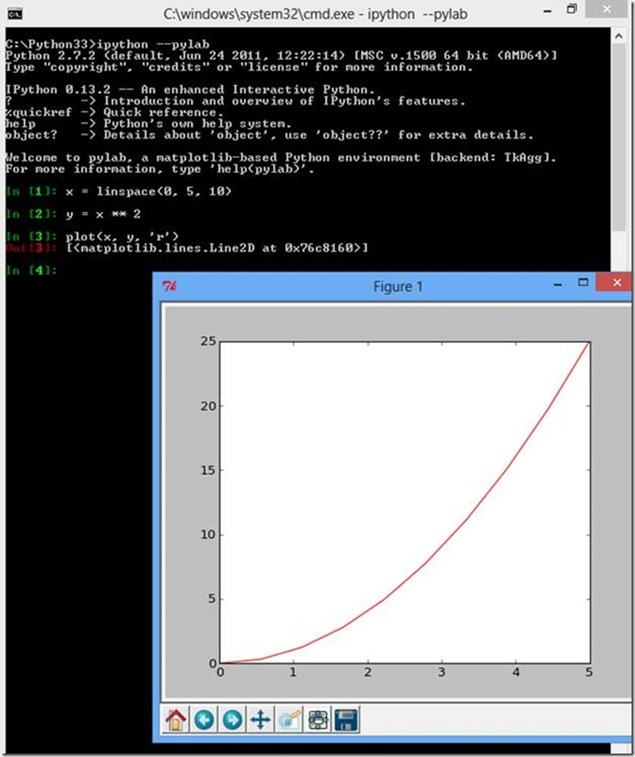

#### 2. Now let's make sure PTVS can find all the right bits (IPython, matplotlib, etc):
* bring up the Python Interpreters window by typing Ctrl-K-` (backtick). Here we see that Python 2.7 64-bit has been selected (<strong>Make Default</strong>):

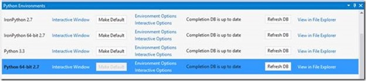

* Click the <strong>View in File Explorer</strong> link and make sure you can see IPython & matplotlib in your Lib\site-packages directory:

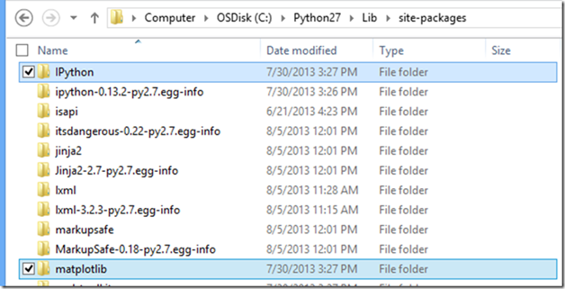

#### 3. On the Interpreters Windows, click the <strong>Interactive Options</strong> and set **Interactive Mode** to IPython:

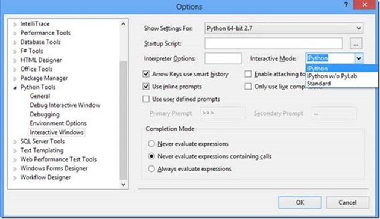

#### 4. On the Interpreters Window, click the **Interactive Window** link to bring up the REPL window (or Alt-I). Now click the blue curved arrow (top left) to RESET the REPL from the previous mode (eg Standard to IPython mode):

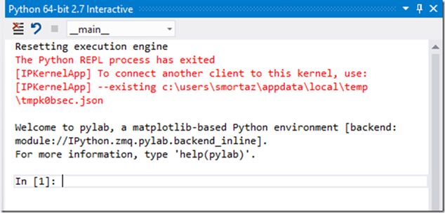

#### 5.&nbsp; Now we're in IPython mode with Pylab. Let's try to plot something. Enter this in the REPL:

	x = linspace(0, 5, 10)
	y = x ** 2
	plot(x, y, 'r')

You should see a graph like this <em>inline</em>:

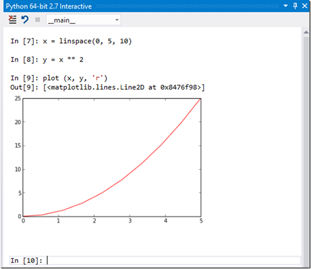

If you hit enter again, you'll see that the image becomes a thumbnail:

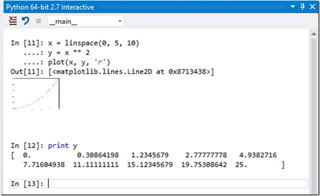

However you can place the mouse pointer on the image and resize it if necessary:

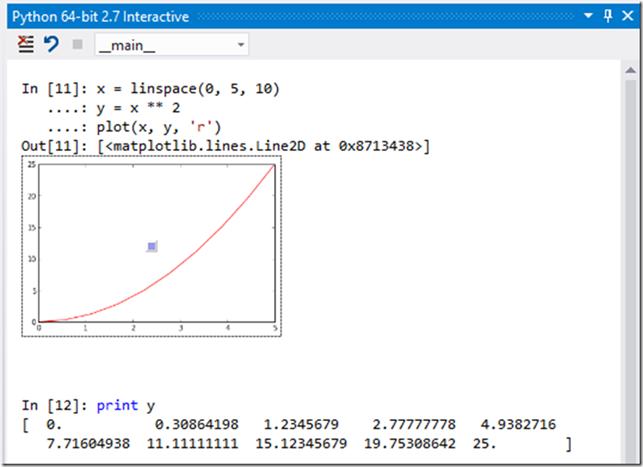

## Entering, pasting and sending code to the REP
Instead of typing in the REPL, you can select text in the Editor and use **CTRL-E-E** to send it to IPython. Try pasting this code into the Editor, then to the REPL via
**CTRL-A**, **CTRL-E-E**:

	from mpl_toolkits.mplot3d import Axes3D
	import matplotlib.pyplot as plt
	import numpy as np
	fig = plt.figure()
	ax = fig.add_subplot(111, projection='3d')
	for c, z in zip(['r', 'g', 'b', 'y'], [30, 20, 10, 0]):
		xs = np.arange(20)
		ys = np.random.rand(20)
		# You can provide either a single color or an array. To demonstrate this,
		# the first bar of each set will be colored cyan.
		cs = [c] * len(xs) 
		cs[0] = 'c' 
		ax.bar(xs, ys, zs=z, zdir='y', color=cs, alpha=0.8)
	
	ax.set_xlabel('X') 
	ax.set_ylabel('Y') 
	ax.set_zlabel('Z') 
	plt.show()</strong>

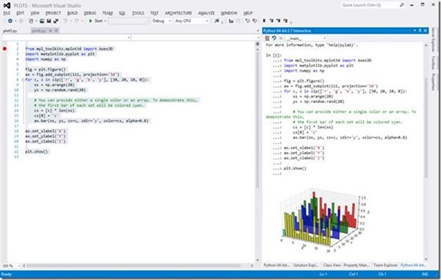

When sending code to the Interactive window (by using Ctrt-E-E), the commands are sent to IPython as one unit to avoid giving you intermediate 'partial' graphs:

So far all the images have been inline in the REPL window. If you run the code from the Editor (CTRL-F5, or right click on the file name & choose Run w/o Debugging), you'll get a standalone matplotlib window:

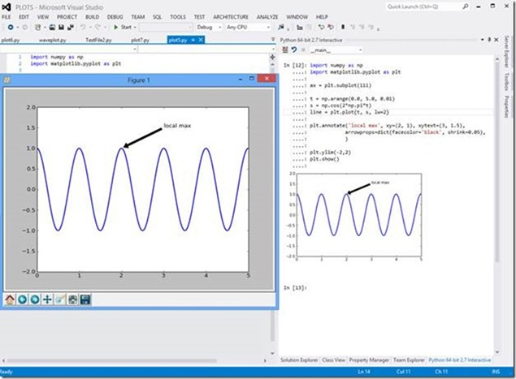

## Shell commands, magics, etc.

IPython has a number of useful features such as escaping to the system shell, variable substitution, capturing output, etc. Please refer to the IPython reference guide for further information:

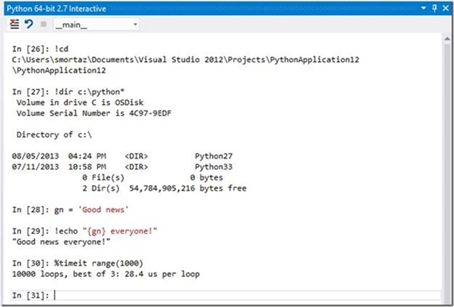

## IPython notebook mode

You can also use IPython in "notebook" mode where you can use any browser on any OS as the canvas. The backend IPython engine can be local on your machine, or remote. Windows Azure has support for running IPython on a Windows or Linux VM.

Please see the following for details:
Video: [http://www.youtube.com/watch?v=ljrSOkMs7DQ](http://www.youtube.com/watch?v=ljrSOkMs7DQ)

Docs: [http://www.windowsazure.com/en-us/develop/python/tutorials/ipython-notebook/](http://www.windowsazure.com/en-us/develop/python/tutorials/ipython-notebook/)

## Limitations
Note that IronPython does not support IPython, despite the fact that you can select it on the Interactive Options form. You can upvote the feature request or implement it if you'd like!
([https://pytools.codeplex.com/workitem/1632](https://pytools.codeplex.com/workitem/1632)).

